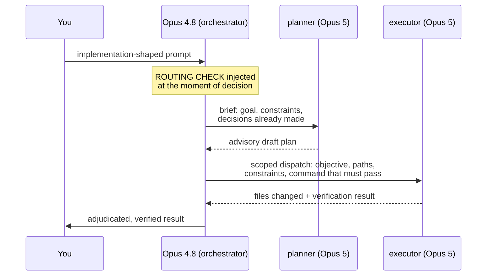

<div align="center">

<picture>
  <source media="(prefers-color-scheme: dark)" srcset="assets/logo-dark.png">
  
</picture>

# opus-rail

**4.8 drives. 5 works.**

Claude Code orchestration where Opus 4.8 is the main-loop orchestrator and
Opus 5 runs only inside tightly scoped subagents.

[](LICENSE)
[](https://code.claude.com/docs)
[](#)

</div>

---

## Why

Measured in real use: Opus 4.8 as the orchestrator follows project doctrine,
keeps a leaner context window, and produces a better working flow — while Opus 5
is at its best inside single-objective, fully scoped tasks. opus-rail wires that
split into Claude Code instead of hoping the model remembers it:

| Lane | Model | Job |
|---|---|---|
| **orchestrator** | Opus 4.8 (main loop) | frame tasks, dispatch self-sufficient briefs, adjudicate, verify, commit |
| **`planner`** | Opus 5 | drafts plans/designs as advisory drafts the orchestrator adjudicates |
| **`executor`** | Opus 5 | implementation, debugging, tests, focused review — per task |
| **`worker`** | Sonnet | mechanical bulk, read-heavy search |
| **`redteam`** | Opus 5 | on-demand adversarial review — ask for it; not a routine pass |

Every dispatch brief is **self-sufficient**: objective, exact paths, constraints,
the command that must pass, the return format — and the decisions already made,
with reasons. Agents work instead of re-orienting from the repo, and are
instructed to return gaps rather than reconstruct context.



### Modes

- **standard** — the planner lane drafts substantive plans and designs; trivial
  sequencing stays inline with the orchestrator.
- **plus** — the planner lane drafts **all** plan-shaped work, however small.
  Full system: `"OPUS_RAIL_PLUS": "1"` in the settings `env` block. Skill:
  `/opus-rail plus`.
- **redteam** — on-demand in both variants: in the full system just ask
  ("redteam this"); in the skill, arm it with `/opus-rail redteam`.
- **disable** — per-session kill-switch in both variants: `/opus-rail disable`
  (the full system ships a control skill for it; plain-text `opus-rail off`
  works hook-only) stands down for the session; `/opus-rail enable` /
  `/opus-rail` resumes. The full system's control skill also adds
  `/opus-rail status` for hook telemetry.

## Does it actually change behavior?

The core mechanism exists because prose alone measurably failed. Same class of
2-file task, same session setup, live A/B:

| | rails as prose only | with point-of-decision routing check |
|---|---|---|
| subagent dispatches | 0 | 1 (scoped, 2.6k-char brief) |
| direct edits by orchestrator | 2 | **0** |

The system was then reviewed adversarially three ways — by a Claude redteam
agent, by GPT via Codex, and by Kimi K3 — and every surviving finding was fixed
(see the commit history, which documents what each review caught).

The strongest observed benefits are interactive-session properties — doctrine
adherence over long sessions and a lean orchestrator context (delegated churn
never enters the 4.8 window). Those resist honest measurement in one-shot
harnesses; an earlier benchmark attempt is preserved on the `bench-archive`
branch for anyone who wants to build a multi-turn version.

## Install

Two variants — run **one**, not both:

### Full system (hook-enforced)

Model-conditional hooks inject the rules only into Opus sessions, re-inject
after compaction, fire a routing check on implementation-shaped prompts, and
log telemetry (`opus-rails.py stats`). → **[full/INSTALL.md](full/INSTALL.md)**

### Skill only (zero-footprint)

No hooks, no settings surgery. Copy one folder, run `/opus-rail` per session
(`/opus-rail plus` to route all plan-shaped work through the planner lane,
`/opus-rail redteam` to arm the dispatched adversarial reviewer):

```bash
mkdir -p ~/.claude/skills && cp -R skill/opus-rail ~/.claude/skills/
```

The trade: instructions instead of hook enforcement, and it assumes an unpinned
`opus` alias (= Opus 5) for its subagent lanes. → **[skill/opus-rail/SKILL.md](skill/opus-rail/SKILL.md)**

## Known boundaries (measured)

- **Hooks do not fire inside subagents** — verified live (a `pip install` inside a
  subagent ran uninterception). Guards you care about must live in the agent
  definitions; the ones shipped here do.
- **Headless `--print` sessions** have no statusline, so first-prompt model
  resolution needs a pre-written session flag (`--session-id` + flag file) or
  falls back to transcript scan from the second exchange.
- The rails text is opinionated, derived from audited failure sessions; edit the
  words, keep the mechanism.
- The full system's env pin re-points the `opus` alias **machine-wide** to 4.8;
  `/model claude-opus-5` bypasses it. The rails still fire in that solo mode and
  say so: no model is restricted from spawning subagents (docs-verified — only
  nesting *inside* subagents is depth-limited), so the delegation doctrine
  applies there too, where it matters most.

## Repo layout

```
full/    hook, agents, control skill, settings snippet, install guide
skill/   the /opus-rail session skill (skill-only variant)
assets/  logos
```

## License

[MIT](LICENSE) © 2026 TigerGTC
