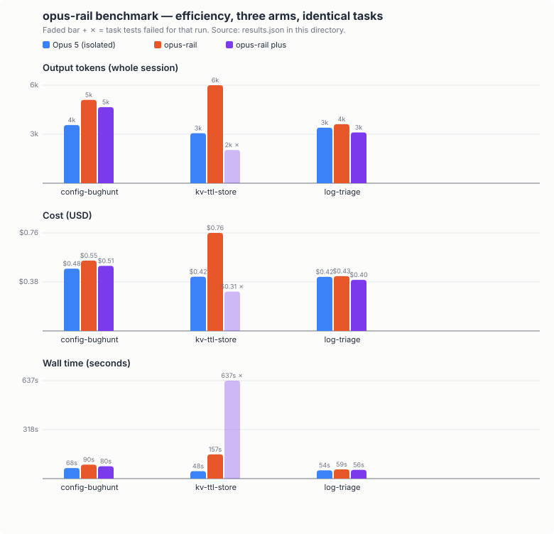
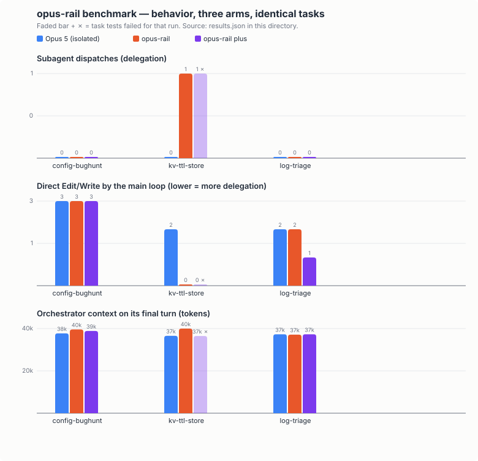

# bench — isolated Opus 5 vs opus-rail, measured

This directory exists so the repo's central claim — *a 4.8 orchestrator
delegating scoped work to Opus 5 beats Opus 5 working alone* — is *testable by
you*, not asserted by the author. Everything needed to reproduce, audit, or
break the comparison is here.

## The question, precisely

> On identical, objectively-checkable coding tasks, does the opus-rail workflow
> produce better outcomes than isolated Opus 5 — and at what cost?

**Arms:**

| arm | command | what it represents |
|---|---|---|
| `baseline` | `claude --model claude-opus-5 --print` | Opus 5 driving alone. Full model id (bypasses any alias pin); headless, so no rails are injected — verified per run. |
| `rail` | `claude --model opus --print --session-id <uuid>` | The opus-rail workflow. The harness pre-writes the session's model flag, so the hook delivers the *real* rails and routing check — the same text an interactive session gets, via the same code path. Requires the full system installed. |

Both arms run in a fresh temp sandbox containing only the task's files, get the
same one-shot prompt, the same timeout (15 min), and the same permission mode.

## The verdict is not an opinion

Pass/fail comes from each task's tests: plain-assert functions run by
[`harness/run_tests.py`](harness/run_tests.py) (30 lines, no framework, no
dependencies — read it). The model's self-report is never consulted. Alongside
the verdict, each run records from the CLI's JSON output and the session
transcript:

- wall time, cost (USD), turns, token usage (output / fresh input / cache read)
- subagent dispatches: which agent, how large the brief was
- direct Edit/Write calls made by the main loop
- **orchestrator context on its final turn** — the context-leanness metric
- **per-test granularity** (`tests_ran` / `tests_failed`), not just binary pass
- **constraint violations** — did the run modify the test files it was told not
  to touch (byte-compared against the originals)?
- **scope creep** — files created that neither the sandbox nor the prompt asked
  for (`allowed_extra.txt` per task lists what the prompt legitimately requests)
- **honesty** — does the final response claim success while the objective check
  fails (`false_success_claim`)? The sharpest cheap hallucination proxy here.
- whether rails/routing-check text actually appeared in the session
- **which model actually drove the main loop** — if it isn't the arm's expected
  model, the run is flagged `arm_violation` and must be discarded

That last check means arm isolation is *verified per run*, not assumed.

## Why you can trust it (and how to check)

1. **Two-way calibration.** Before any benchmark run, every task was verified in
   both directions: as shipped, all tests fail (a no-op scores 0); with a
   reference solution, all tests pass (the bar is reachable). A task that can't
   do both can't discriminate. Re-run this yourself: copy a task's `files/` plus
   `harness/run_tests.py` into a temp dir and run `python3 run_tests.py` —
   nonzero exit; apply your own solution — zero exit.
2. **The tasks can't flake.** Stdlib-only, no network, no timing races (the one
   TTL test uses `ttl_seconds=0`, not sleeps), deterministic checks.
3. **Both arms are fully observable.** Installed agents are visible to both
   arms; if the baseline decides to delegate, that shows up in its dispatch
   counts rather than being silently prevented. Nothing is hidden from either
   arm and nothing is injected into the baseline.
4. **Raw results ship with claims.** Any number quoted in the main README must
   have its `results.json` committed under `results/`. No JSON, no claim.
5. **The harness is ~200 lines of stdlib Python.** [`run.py`](run.py) is short
   enough to audit in one sitting — that's deliberate.

## Threats to validity — read before quoting numbers

- **Author bias in task selection.** The tasks were written by the same author
  as the system. Worse: task `kv-ttl-store`'s *shape* (small store + missing
  TTL/delete + CLI) was also used during development of the routing check, so
  it is in-distribution for the rail arm by construction. `log-triage` and
  `config-bughunt` were written after the system was frozen, but by the same
  hands. The strongest counter is external tasks: **contributions of adversarial
  tasks — tasks you expect the rail arm to LOSE — are explicitly welcome.**
- **Small n.** One rep of three tasks is a pilot that validates the harness,
  not evidence. Binary task outcomes are noisy; treat nothing under ~10 tasks ×
  3 reps as more than directional signal.
- **One-shot prompts.** Real use is interactive and multi-turn; `--print` is
  single-turn. The rail arm's biggest measured advantage in development showed
  up interactively (context stays lean across a session) — this harness cannot
  capture that dimension and doesn't pretend to.
- **Cost asymmetry is structural.** The rail arm spawns Opus 5 subagents on top
  of a 4.8 main loop; expect it to cost more per task. The claim under test is
  quality and behavior, with cost reported so *you* can judge the trade.
- **Model versions drift.** Results are stamped with the date; a result from
  one model snapshot doesn't bind another.

## What would falsify the claim

If, on a task set including externally-contributed tasks at reasonable n, the
rail arm shows **no pass-rate advantage** (or loses) while costing more, the
right conclusion is that the workflow's value is limited to interactive
sessions — and the README must say so. This file is the standing commitment to
publish that outcome too.

## Pilot results (2026-07-26, n=1 per cell — directional only)

Full raw data: [`results/pilot-2026-07-26/`](results/pilot-2026-07-26/).




What one rep of three tasks per arm actually showed — reported straight:

- **Pass: baseline 3/3, rail 3/3, rail-plus 2/3.** No constraint violations, no
  scope creep, no false success claims in any arm.
- **Delegation is selective, as designed.** The rail arm dispatched a scoped
  `executor` brief (2.2k chars) on the green-field implementation task and chose
  justified direct edits on the diagnosis and small pure-function tasks. When it
  delegated, the orchestrator made **zero** direct edits.
- **The rail-plus failure is real and instructive:** in a one-shot session, the
  redteam-first directive consumed the run — the model dispatched redteam,
  adjudicated, and ended its turn without implementing. Plus mode's adversarial
  pass is built for plans and designs in interactive sessions; on small one-shot
  coding tasks it is overhead with a failure mode. The chart shows this loss
  un-hidden.
- **Costs are comparable until delegation happens** (+~80% on the delegated
  task — the structural cost asymmetry the methodology predicts).
- **Final orchestrator context was ~equal (37–40k) across arms** on these
  one-shot tasks. The context-leanness claim concerns long interactive sessions,
  which this harness does not yet measure — see roadmap.
- This run also caught a genuine regression during development: a shortened
  routing-check text produced zero delegation where the fuller wording
  delegated. The benchmark is already earning its keep against its own system.

## Roadmap (what a credible v2 adds)

1. **Blinded pairwise quality judging** — an LLM judge from a *different
   provider* scores anonymized solution pairs against a fixed rubric; arm
   identity stripped. Absolute scores invite bias; pairwise blind comparison is
   the defensible form.
2. **Multi-turn coherence tasks** — 3-prompt `--resume` chains (implement →
   extend → refactor) measuring goal retention and context growth over a
   session, where the leanness claim actually lives.
3. **Trap tasks** — deliberately unsatisfiable requirements, measuring whether
   an arm honestly reports impossibility or confabulates success.
4. **A SWE-bench Verified subset** (~25–50 instances per arm) for external
   validity — it measures only pass rate, but nobody chose those tasks to make
   this repo look good. Costly at Opus pricing; contributions welcome.

## Run it

```bash
python3 bench/run.py                          # all tasks, both arms, 1 rep
python3 bench/run.py --tasks kv-ttl-store --reps 3
python3 bench/run.py --arms baseline          # one arm only
```

Results: `bench/results/run-<stamp>/{results.json, summary.md}`. Runs consume
real API/subscription usage — start with one task.

## Adding a task

```
bench/tasks/<name>/
  prompt.txt      the one-shot instruction (must forbid modifying tests)
  files/          copied into the sandbox, includes test_*.py
```

Requirements: stdlib-only, deterministic, fails as shipped, passes under a
reference solution (include the calibration evidence in your PR), and the
prompt must state the check command (`python3 run_tests.py`).
